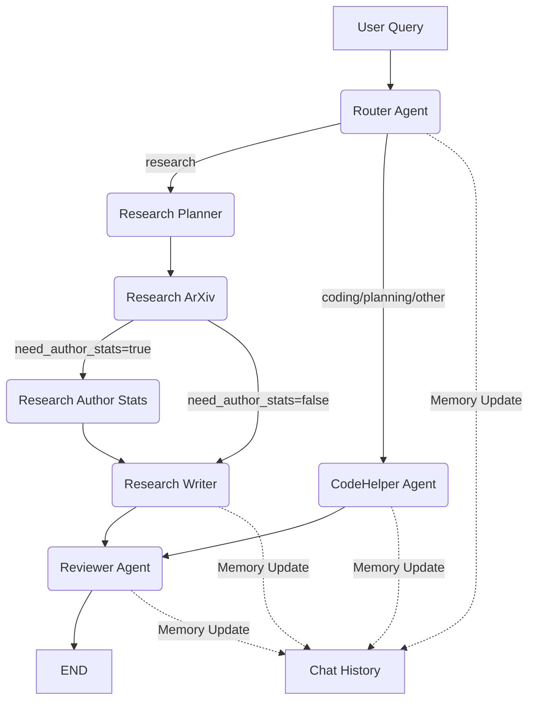

# Multi-Agent Study & Productivity Assistant

This project implements a Multi-Agent System (MAS) using LangChain and LangGraph. It serves as a study and productivity assistant, capable of handling research queries, coding questions, and more by routing them to specialized agents.

## Features

*   **Multi-Agent Architecture**: Uses 7 distinct agents: Router, Research Planner, Research ArXiv, Research Author Stats, Research Writer, CodeHelper, and Reviewer.
*   **LangGraph Orchestration**: Manages agent interactions and state.
*   **Tool Calling**: Uses an `arxiv` search tool for research tasks.
*   **Memory Management**: Maintains a simple chat history within a session.
*   **Reusable Components**: Code is structured into separate modules for agents, tools, and state.

## Setup

1.  **Clone the Repository** (or download the folder structure).
2.  **Create a Virtual Environment** (recommended to isolate dependencies):
    *   Open your terminal/command prompt in the project directory.
    *   Run: `python -m venv venv`
    *   Activate it:
        *   On Windows: `venv\Scripts\activate`
        *   On macOS/Linux: `source venv/bin/activate`
3.  **Install Dependencies**: Run `pip install -r requirements.txt`.
4.  **Environment Variables**: Create a `.env` file in the project root (same level as `run_demo.py`) with the following content:
    ```env
    LITELLM_BASE_URL=http://a6k2.dgx:34000/v1
    LITELLM_API_KEY=
    MODEL_NAME=qwen3-32b
    ```
    Replace the values with your actual vLLM endpoint details if they differ.

## Architecture

### Agents

*   **Router Agent**: Classifies the user query into categories like 'research', 'coding', 'planning', 'other' and routes to the appropriate specialist agent.
*   **Research Planner Agent**: Creates a search plan based on the query, extracting keywords, deciding minimum year, and whether author stats are needed.
*   **Research ArXiv Agent**: Executes arXiv search using the plan from the planner.
*   **Research Author Stats Agent**: Fetches author statistics (mock implementation returning placeholder data).
*   **Research Writer Agent**: Summarizes research results into a structured literature review format.
*   **CodeHelper Agent**: Provides assistance with coding-related queries and general questions.
*   **Reviewer Agent**: Validates outputs from both research and code paths for quality, completeness, accuracy, and clarity before returning to the user.

### MAS Pattern

The system implements a **Router + Specialists** pattern. The Router Agent decides which specialist agent (Researcher or CodeHelper) should handle the request based on its classification.

### Tool Calling

**Where tools are invoked:**
- **Research ArXiv Agent** (`research_arxiv` node): Calls `search_arxiv()` tool to query arXiv API for papers matching keywords and year criteria.
- **Research Author Stats Agent** (`research_author_stats` node): Calls `author_stats()` tool to fetch author statistics. *Note: Currently implemented as a mock that returns placeholder data. In production, this would query external APIs like Semantic Scholar or ORCID.*

**Tool calling pattern:**
- Tools are called directly by agent nodes (not through LLM tool calling mechanism)
- Results are stored in state and passed to subsequent agents
- Mock tools are clearly documented to distinguish from real API calls

**Tool Purpose:**
- `search_arxiv`: Real tool that searches arXiv database for academic papers.
- `author_stats`: Mock tool demonstrating the pattern (returns placeholder h-index and paper counts). Documented as mock to avoid confusion about real vs. simulated functionality.

### Memory Management

**What is stored:**
- **Chat History**: List of user queries and assistant responses within the session, stored in `state["chat_history"]`.
- **User Profile**: Dictionary for storing user preferences/metadata (currently minimal, extensible).

**Where it's stored:**
- Memory is maintained in the LangGraph `State` object during graph execution.
- Currently in-memory only (not persisted to disk between sessions).

**How it influences later steps:**
- Router Agent: Updates chat history with user query.
- Research Writer Agent: Uses last 2 messages from chat history for context when summarizing research results.
- CodeHelper Agent: Uses last 3 messages from chat history as context when generating responses.
- Reviewer Agent: Uses chat history to understand conversation context when reviewing responses.
- All agents update chat history with their outputs, maintaining a complete conversation record.

### Diagram



## Running the Demo

Execute `python run_demo.py` to run the system on a set of example queries. The script demonstrates:
- Query routing to appropriate agents
- Research workflow (planner → arxiv → [author_stats] → writer → reviewer)
- Code assistance workflow (code_helper → reviewer)
- Memory accumulation across interactions
- Quality review before returning final answers

## Reflection

### What Worked Well

1. **Architecture Design**: The Router + Specialists + Reviewer pattern provides clear separation of concerns. Each agent has a well-defined role, making the system easy to understand and extend. The addition of the Reviewer Agent adds a quality control layer that validates outputs before returning to users.

2. **LangGraph Integration**: LangGraph's state management and conditional routing work excellently for orchestrating multi-agent workflows. The graph structure makes the control flow explicit and debuggable. Adding the reviewer as a final step before END creates a clean quality gate.

3. **Tool Calling Pattern**: The arXiv search tool integration demonstrates real external API usage effectively. The tool calling pattern is clean and reusable. Mock tools (author_stats) are clearly documented to avoid confusion.

4. **State Management**: Using TypedDict for state provides type safety and clear documentation of what data flows between agents. Adding `reviewer_feedback` and `final_answer` fields makes the reviewer's role explicit in the state.

5. **Memory Integration**: Memory is now used across multiple agents:
   - Router updates history with user queries
   - Research Writer uses last 2 messages for context
   - CodeHelper uses last 3 messages for context
   - Reviewer uses history to understand conversation context
   - All agents update history with their outputs

6. **Reviewer Agent Implementation**: The Reviewer Agent successfully validates outputs from both research and code paths. It checks for completeness, accuracy, clarity, and relevance, providing feedback that can be included in the final answer if issues are detected.

### Issues and Failures

1. **Router Classification Bug**: Initially, the router incorrectly accessed `state["query"]` as if it were a list of messages, causing misclassification. Fixed by properly formatting the prompt with the string query.

2. **Graph Edge Conflicts**: The original implementation had both unconditional and conditional edges from the router, causing conflicting routing logic. Fixed by removing the unconditional edge and using only conditional routing.

3. **Mock Tool Documentation**: The `author_stats` tool was implemented as a mock but not clearly documented. Fixed by adding explicit documentation explaining it's a placeholder.

4. **Diagram Completeness**: The original diagram didn't show all agent nodes and their connections. Updated to show all nodes including the reviewer and their relationships.

5. **Reviewer Limitations**: The reviewer currently always approves or adds feedback but doesn't trigger revision loops. In a production system, it could route back to the original agent for revision if quality is insufficient.

6. **Memory Scope**: While memory is used, it's still limited to recent messages. For longer conversations, a more sophisticated retrieval mechanism (RAG-style) would be beneficial.

### System Quality Assessment

**Strengths:**
- ✅ Clear architecture with 7 distinct agents (Router, Research Planner, ArXiv, Author Stats, Writer, CodeHelper, Reviewer)
- ✅ Real tool integration (arXiv search)
- ✅ Proper state management with type safety
- ✅ Quality control through Reviewer Agent
- ✅ Memory integration across multiple agents
- ✅ Extensible design supporting future enhancements
- ✅ All agents properly documented and integrated

**Weaknesses:**
- ⚠️ Reviewer doesn't trigger revision loops (always passes through)
- ⚠️ Mock tool (author_stats) returns placeholder data
- ⚠️ Limited error recovery mechanisms
- ⚠️ Router could use chat history for better classification
- ⚠️ Memory limited to recent messages, not full conversation context

**Overall Assessment:**

The system successfully demonstrates a complete multi-agent orchestration with LangGraph, featuring:
- **7 distinct agents** working together in a coordinated workflow
- **Real tool calling** (arXiv API) and **mock tool** (author_stats) clearly distinguished
- **Memory management** integrated across multiple agents
- **Quality control** through the Reviewer Agent
- **Proper handoff** between agents via conditional routing

The Router + Specialists + Reviewer pattern works well for this use case. The addition of the Reviewer Agent adds a valuable quality assurance layer. The codebase is well-structured and supports future enhancements such as:
- Revision loops when reviewer detects issues
- Real author stats API integration
- Enhanced memory with RAG-style retrieval
- More sophisticated routing using conversation history

The system demonstrates all required MAS patterns (router, planner-executor, supervisor/reviewer), tool calling, and memory management in a coherent, working implementation.